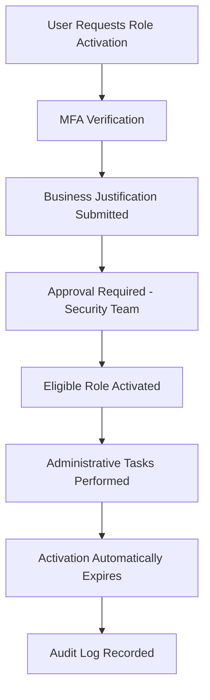

# 02 - Privileged Identity Management (PIM)

**Previous:** [01 - Current State Assessment](../01-current-state-assessment/README.md) | **Next:** [03 - Entitlement Management](../03-entitlement-management/README.md)

---

## Purpose

Permanent administrator assignments significantly increase organizational risk by creating standing privileged access. Microsoft Entra Privileged Identity Management enables Just-In-Time access, requiring privileged users to activate administrative roles only when necessary.

---

## Current Administrative Roles

| Role | Assignment Type | Status |
|---|---|---|
| Global Administrator | Permanent | Current State |
| Global Reader | Permanent | Current State |
| Security Administrator | Planned | Future |
| User Administrator | Planned | Future |

---

## Target State

All privileged roles transition from permanent assignments to Eligible assignments managed through PIM.

| Capability | Configuration |
|---|---|
| Assignment Type | Eligible |
| Activation | Just-In-Time |
| MFA Required | Yes |
| Justification Required | Yes |
| Approval Required | Security Team |
| Maximum Activation Duration | 4 Hours |
| Notifications | Enabled |
| Audit Logging | Enabled |

---

## Privileged Access Workflow

---

## Administrative Roles Protected

| Role | Governance |
|---|---|
| Global Administrator | PIM Eligible |
| Security Administrator | PIM Eligible |
| User Administrator | PIM Eligible |
| Privileged Role Administrator | PIM Eligible |
| Conditional Access Administrator | PIM Eligible |

---

## PIM Configuration Standards

| Setting | Value |
|---|---|
| Eligible Assignments | Enabled |
| Permanent Assignments | Minimized |
| MFA on Activation | Required |
| Justification | Required |
| Approval Workflow | Enabled |
| Maximum Duration | 4 Hours |
| Notifications | Email Enabled |

---

## Security Benefits

- Eliminates standing administrative privileges
- Reduces attack surface
- Supports Zero Trust principles
- Improves audit visibility
- Provides complete activation history
- Enables least privilege administration
- Supports regulatory compliance
- Reduces lateral movement risk

---

## Screenshots

### 1. PIM Roles Overview
Shows the Microsoft Entra PIM roles available for governance configuration.

---

### 2. Global Administrator Role
Shows the Global Administrator role selected for PIM eligible assignment configuration.

---

### 3. Eligible Role Assignment
Shows the eligible assignment being configured for the Global Administrator role.

---

### 4. Activation Settings
Shows the PIM activation settings including MFA requirement, justification, and maximum duration.

---

### 5. PIM Role Assignments
Shows the confirmed PIM role assignments in the OmniVerse tenant.

---

### 6. PIM Role Settings Summary
Shows the final PIM role settings summary confirming all configuration was applied correctly.

