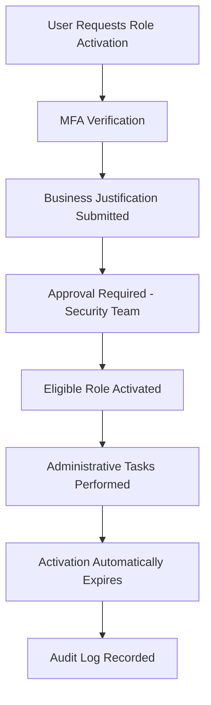

# 02 - Privileged Identity Management (PIM)

**Previous:** [01 - Current State Assessment](../01-current-state-assessment/README.md) | **Next:** [03 - Entitlement Management](../03-entitlement-management/README.md)

---

## Purpose

Permanent administrator assignments significantly increase organizational risk by creating standing privileged access. Microsoft Entra Privileged Identity Management enables Just-In-Time access, requiring privileged users to activate administrative roles only when necessary.

This phase documents the design and implementation of the privileged access management strategy for the OmniVerse environment.

---

## Current Administrative Roles

| Role | Assignment Type | Status |
|---|---|---|
| Global Administrator | Permanent | Current State |
| Global Reader | Permanent | Current State |
| Security Administrator | Planned | Future |
| User Administrator | Planned | Future |

---

## Target State

All privileged roles transition from permanent assignments to Eligible assignments managed through PIM.

| Capability | Configuration |
|---|---|
| Assignment Type | Eligible |
| Activation | Just-In-Time |
| MFA Required | Yes |
| Justification Required | Yes |
| Approval Required | Security Team |
| Maximum Activation Duration | 4 Hours |
| Notifications | Enabled |
| Audit Logging | Enabled |

---

## Privileged Access Workflow

---

## Administrative Roles Protected

| Role | Governance |
|---|---|
| Global Administrator | PIM Eligible |
| Security Administrator | PIM Eligible |
| User Administrator | PIM Eligible |
| Privileged Role Administrator | PIM Eligible |
| Conditional Access Administrator | PIM Eligible |

---

## PIM Configuration Standards

| Setting | Value |
|---|---|
| Eligible Assignments | Enabled |
| Permanent Assignments | Minimized |
| MFA on Activation | Required |
| Justification | Required |
| Ticket Number | Optional |
| Approval Workflow | Enabled |
| Maximum Duration | 4 Hours |
| Notifications | Email Enabled |

---

## Security Benefits

- Eliminates standing administrative privileges
- Reduces attack surface
- Supports Zero Trust principles
- Improves audit visibility
- Provides complete activation history
- Enables least privilege administration
- Supports regulatory compliance
- Reduces lateral movement risk

---

## Screenshots

### 1. Privileged Identity Management Overview
Shows the Microsoft Entra PIM overview confirming the feature is active in the OmniVerse tenant.

### 2. Microsoft Entra Roles
Shows the list of Microsoft Entra directory roles available for PIM governance.

### 3. Global Administrator Role
Shows the Global Administrator role selected for PIM eligible assignment configuration.

### 4. Eligible Assignment Configuration
Shows the eligible assignment being configured for the Global Administrator role.

### 5. Activation Settings
Shows the PIM activation settings including MFA requirement, justification, and maximum duration.

### 6. Approval Settings
Shows the approval workflow configured for privileged role activation requests.

### 7. Notification Settings
Shows the notification configuration for PIM role activations and approvals.

### 8. PIM Audit History
Shows the PIM audit log confirming role assignment and activation events are being tracked.

### 9. Activation Workflow
Shows the role activation request workflow from the user perspective.

### 10. My Roles Dashboard
Shows the My Roles dashboard where eligible role assignments are visible to the user.

