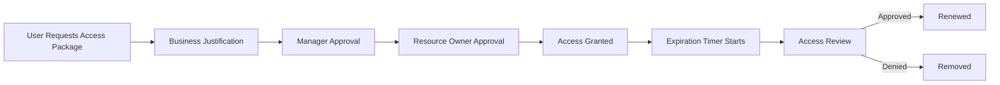

# 03 - Entitlement Management

**Previous:** [02 - PIM Deployment](../02-pim-deployment/README.md) | **Next:** [04 - Access Reviews](../04-access-reviews/README.md)

---

## Purpose

Microsoft Entra Entitlement Management automates access requests, approvals, lifecycle management, and resource assignment using Catalogs and Access Packages. This phase replaces manual access provisioning with a governed, auditable workflow.

---

## Components

| Component | Purpose |
|---|---|
| Catalogs | Organize governed resources into logical containers |
| Access Packages | Bundle resources together for structured access requests |
| Approval Chains | Business approval workflow before access is granted |
| Assignment Policies | Define who can request and under what conditions |
| Expiration Policies | Automatic access removal after defined period |
| Connected Organizations | Enable external collaboration with governance |

---

## Enterprise Access Workflow

---

## Catalog Design

| Catalog | Resources | Audience |
|---|---|---|
| Engineering Resources | Azure DevOps, GitHub Enterprise, Grafana | Engineering team |
| Security Resources | Security tooling, audit logs, Defender | Security team |
| Business Applications | Salesforce, Jira, Confluence | All employees |
| Administrative Resources | Entra admin roles, privileged groups | Admins only |

---

## Access Package Design

| Package | Catalog | Duration | Approval |
|---|---|---|---|
| Engineering Onboarding | Engineering Resources | 90 days | Manager |
| Security Analyst Access | Security Resources | 30 days | Security Lead |
| Business App Standard | Business Applications | 180 days | Manager |
| Admin Elevated Access | Administrative Resources | 8 hours | CISO |

---

## Approval Chain Configuration

| Tier | Approver | Timeout |
|---|---|---|
| First Approval | Direct Manager | 3 days |
| Second Approval | Resource Owner | 3 days |
| Escalation | Department Head | 5 days |

---

## Assignment Policies

- Users can request access for themselves only.
- External users from connected organizations require additional approval.
- All access expires automatically — no permanent assignments.
- Requestors must provide a business justification.
- All requests are logged for audit and compliance.
