# IAM-005 - Enterprise Identity Governance

> OmniVerse Enterprise Engineering Portfolio

## Overview

This repository documents the design, implementation, validation, automation, and operational handoff of a Microsoft Entra ID Identity Governance deployment for the OmniVerse environment.

Identity Governance extends the Zero Trust foundation built in IAM-004 by layering privileged access management, entitlement automation, access certification, and governance reporting on top of the existing Conditional Access baseline.

---

## Business Scenario

OmniVerse completed its Zero Trust Conditional Access deployment and identified significant governance gaps — permanent administrator assignments, no access request workflows, no recurring certification campaigns, and no privileged access audit trail.

The IAM Engineering team was tasked with designing and deploying a full Microsoft Entra Identity Governance program to address these gaps before the environment moves into production.

---

## Engagement Phases

| Phase | Description |
|---|---|
| [01 - Current State Assessment](01-current-state-assessment/README.md) | Governance inventory, security findings, maturity assessment |
| [02 - PIM Deployment](02-pim-deployment/README.md) | Just-In-Time privileged access, eligible assignments, approval workflows |
| [03 - Entitlement Management](03-entitlement-management/README.md) | Catalogs, access packages, approval chains, lifecycle management |
| [04 - Access Reviews](04-access-reviews/README.md) | Quarterly certification campaigns, reviewer assignment, auto-remediation |
| [05 - Governance Automation](05-governance-automation/README.md) | PowerShell export and audit scripts |
| [06 - Operational Handoff](06-operational-handoff/README.md) | Runbook, quarterly operations, future roadmap |
| [Governance Design](docs/) | SoD matrix, PIM workflow, operating model |

---

## Engagement Flow

---

## Technical Implementation

### Privileged Identity Management

| Capability | Configuration |
|---|---|
| Assignment Type | Eligible |
| MFA on Activation | Required |
| Business Justification | Required |
| Approval Workflow | Security Team |
| Maximum Duration | 4 Hours |
| Notifications | Email Enabled |

### Entitlement Management

| Component | Configuration |
|---|---|
| Catalog | Enterprise Resources Catalog |
| Access Package | Engineering Onboarding |
| Approval Policy | Manager approval required |
| Lifecycle Policy | 90-day expiration with review |

### Access Reviews

| Setting | Value |
|---|---|
| Frequency | Quarterly |
| Reviewers | Managers and Resource Owners |
| Decision Helpers | Enabled |
| Auto Apply Results | Enabled |
| Default Decision | Deny |

### Governance Design

| Document | Purpose |
|---|---|
| [Separation of Duties Matrix](docs/01-Separation-of-Duties-Matrix.md) | Role conflict identification and prevention |
| [Privileged Identity Workflow](docs/02-Privileged-Identity-Workflow.md) | End-to-end JIT access lifecycle |
| [Identity Governance Operating Model](docs/03-Identity-Governance-Operating-Model.md) | Governance program structure and principles |

---

## Governance Principles

| Principle | Application |
|---|---|
| Verify Explicitly | MFA and justification required at every activation |
| Least Privilege | No standing admin access — eligible assignments only |
| Just-In-Time Administration | Roles activated on demand, expire automatically |
| Continuous Verification | Quarterly reviews and continuous audit logging |

---

## Screenshot Evidence

### Privileged Identity Management

#### PIM Roles Overview

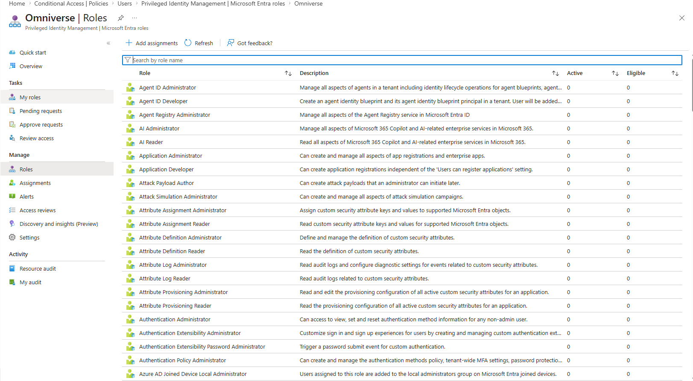

Shows the Microsoft Entra PIM role inventory used to identify privileged roles for governance.

#### Global Administrator Role

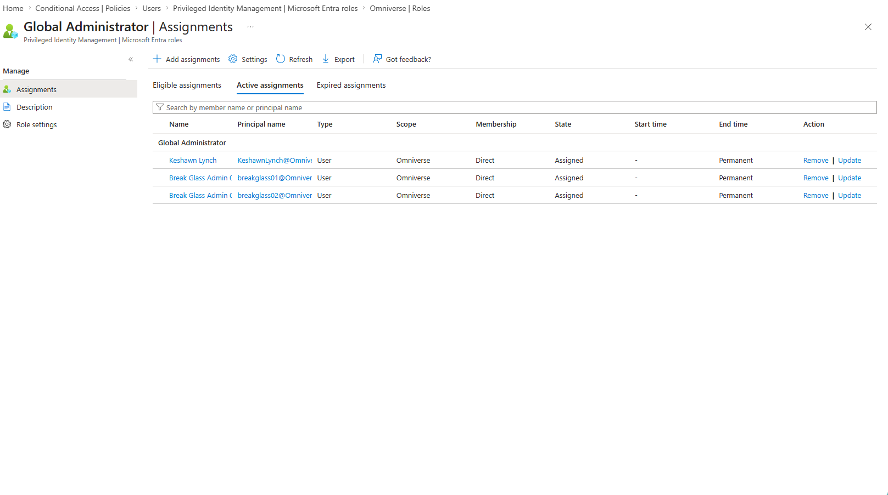

Shows the Global Administrator role selected for privileged access governance.

#### Eligible Role Assignment

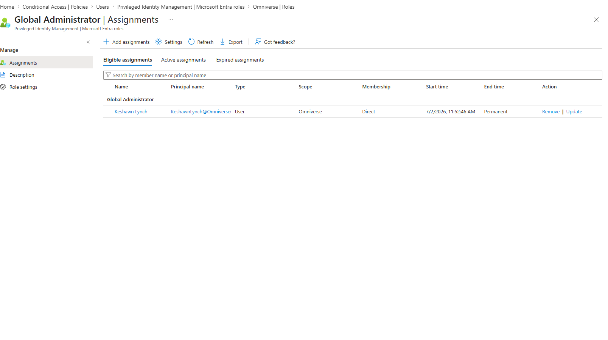

Shows eligible assignment configuration so privileged access is available only when activated.

#### Activation Settings

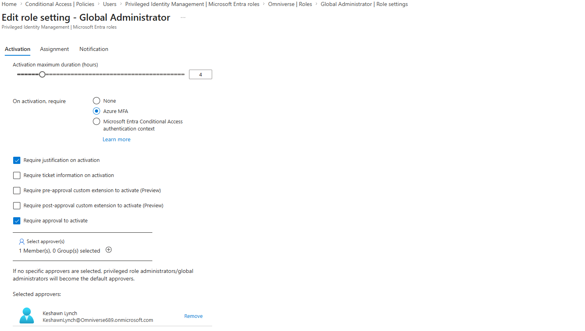

Shows activation requirements including MFA, justification, activation duration, and approval controls.

#### PIM Role Assignments

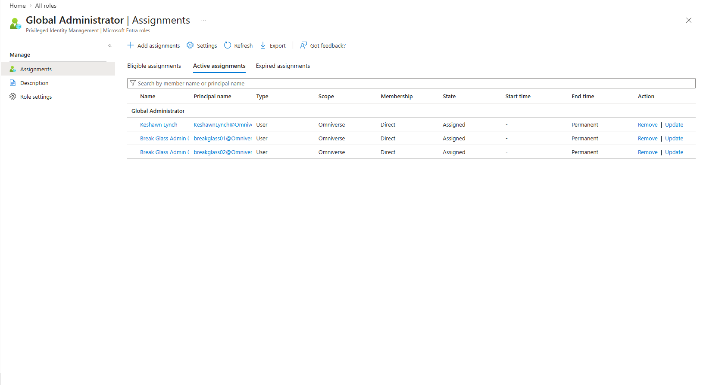

Shows privileged role assignments after PIM configuration.

#### PIM Role Settings Summary

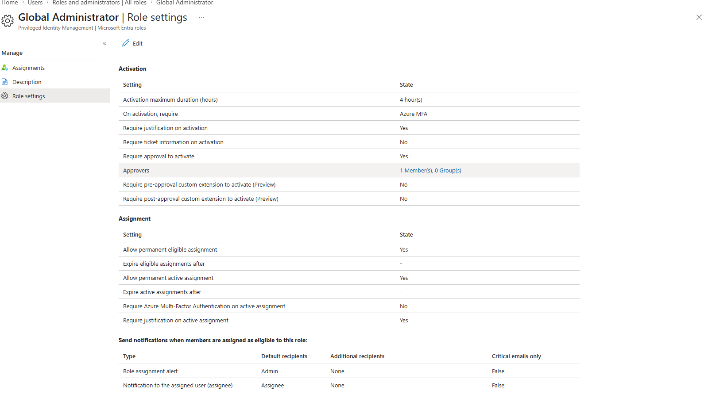

Shows the final role settings summary used to validate the PIM deployment.

### Entitlement Management

#### Identity Governance Catalog

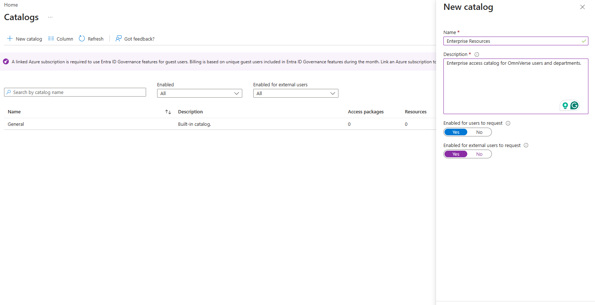

Shows the Enterprise Resources Catalog created for access package governance.

#### Access Package Basics

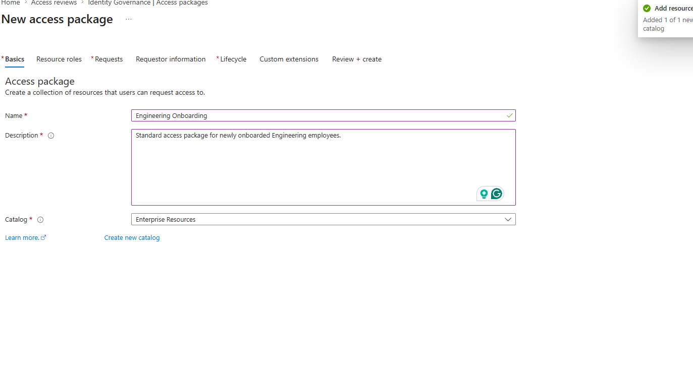

Shows the access package baseline configuration.

#### Access Package Resource Roles

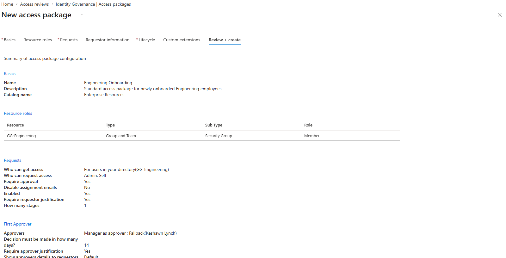

Shows resource roles assigned to the access package.

#### Access Package Request Policy

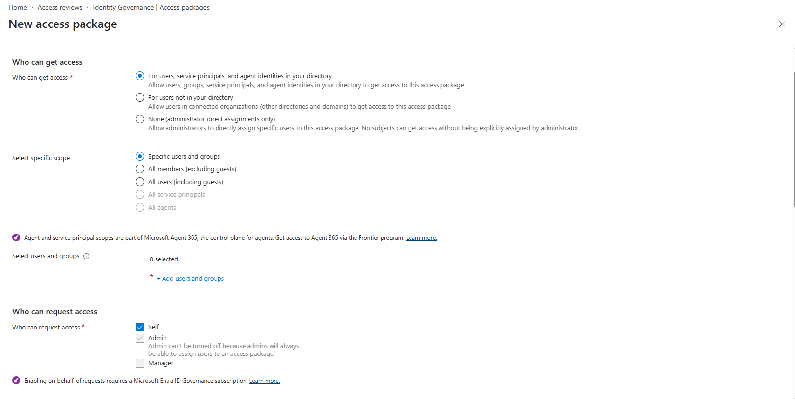

Shows the request and approval policy configured for entitlement access.

#### Lifecycle Review Policy

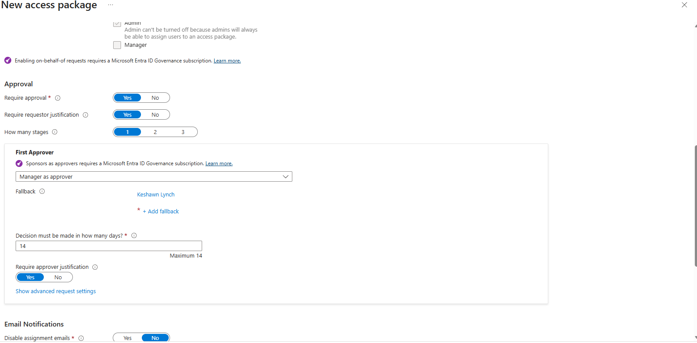

Shows lifecycle expiration and review policy settings for access packages.

#### Access Package Summary

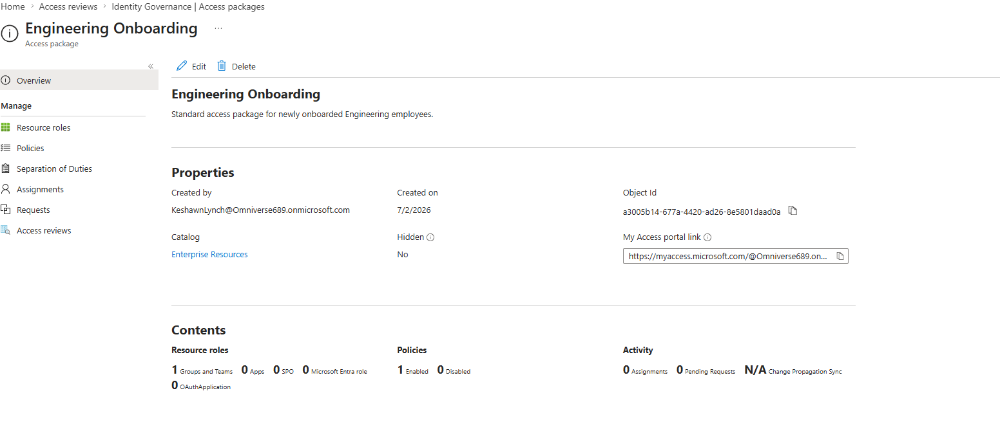

Shows the final access package summary before deployment.

### Access Reviews

#### Create Access Review

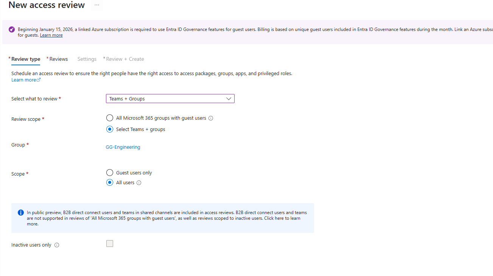

Shows the access review creation workflow used to start certification campaigns.

#### Access Review Schedule

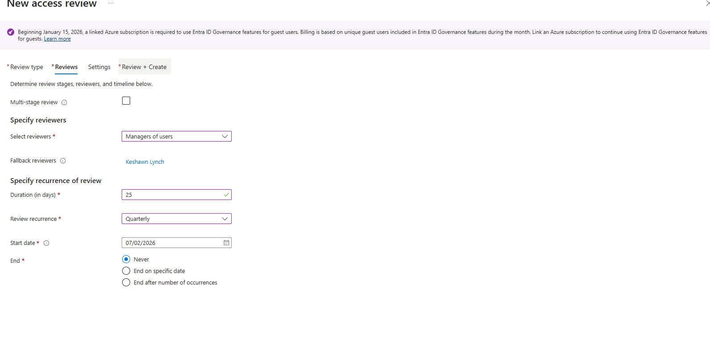

Shows the quarterly review schedule configured for recurring governance.

#### Access Review Settings

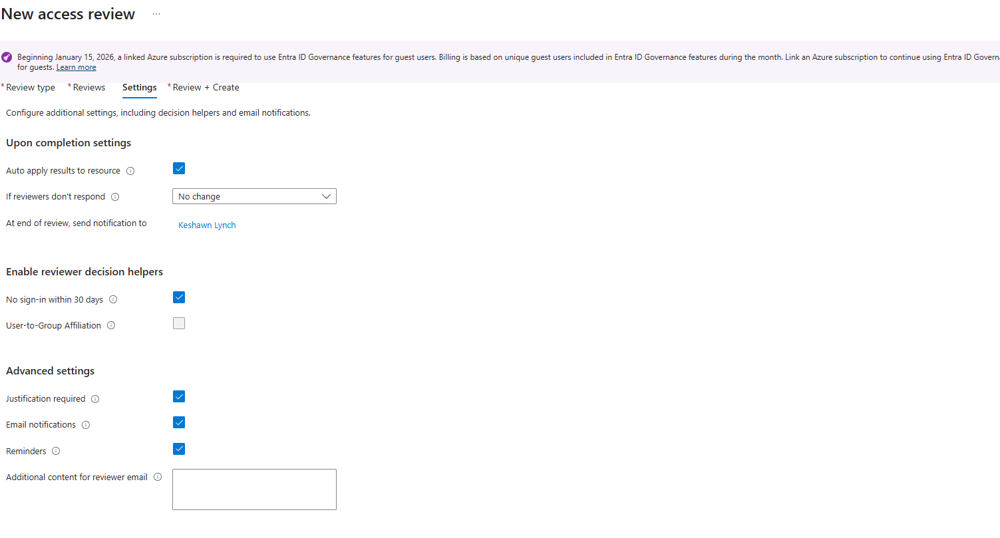

Shows reviewer settings, decision helpers, and remediation behavior.

#### Access Review Summary

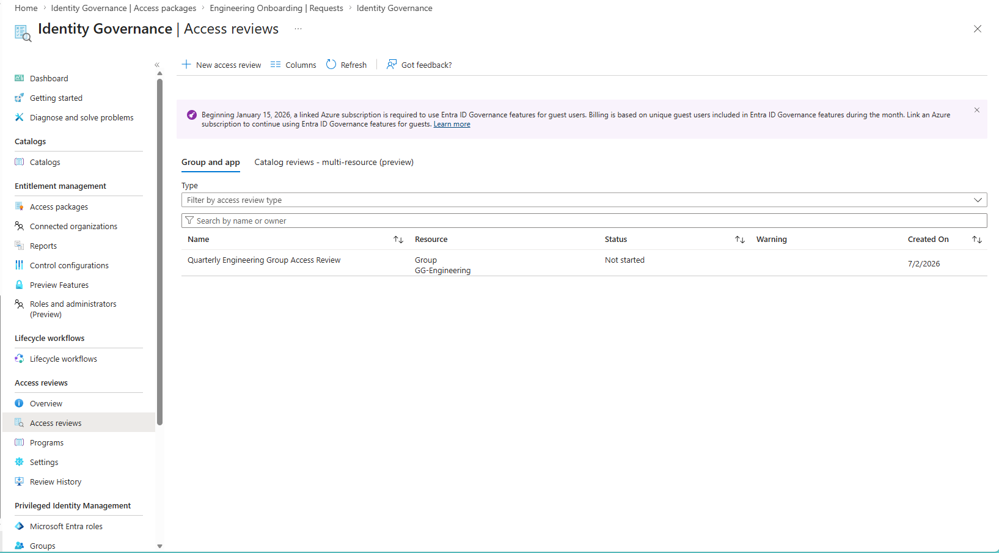

Shows the final access review summary and confirmation before deployment.

---

## Skills Demonstrated

- Microsoft Entra Identity Governance
- Privileged Identity Management (PIM)
- Just-In-Time Access Design
- Entitlement Management and Access Packages
- Catalog Design and Resource Governance
- Access Review Campaign Management
- Separation of Duties Governance
- Approval Workflow Configuration
- Microsoft Graph PowerShell Automation
- Zero Trust Identity Principles

---

## Related Projects

| Project | Description |
|---|---|
| [IAM-001 Hybrid Identity](https://github.com/KSWISHA9/IAM-001-Hybrid-Identity-Engineering) | Active Directory and Microsoft Entra Connect |
| [IAM-003 Identity Lifecycle](https://github.com/KSWISHA9/IAM-003-Identity-Lifecycle-Automation) | Joiner-Mover-Leaver automation |
| [IAM-002 Enterprise SSO](https://github.com/KSWISHA9/IAM-002-Enterprise-Application-Onboarding-SSO) | Enterprise application onboarding |
| [IAM-004 Zero Trust](https://github.com/KSWISHA9/IAM-004-Conditional-Access-Zero-Trust) | Conditional Access baseline |

---

Created by **Keshawn Lynch**
