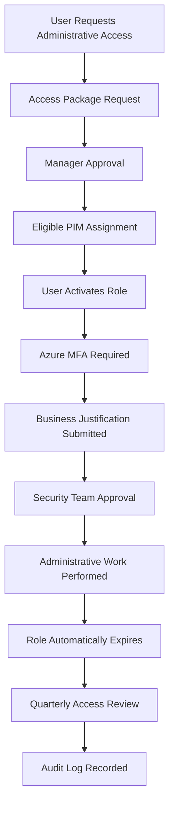

# Privileged Identity Workflow

## Purpose

This document describes the lifecycle of privileged access within the OmniVerse Microsoft Entra ID environment, from initial request through automatic expiration and quarterly review.

---

## Workflow

---

## Security Controls

| Control | Description |
|---|---|
| Azure MFA | Required at every role activation |
| Business Justification | Submitted with every activation request |
| Approval Workflow | Security team approval enforced |
| Time-Limited Access | Maximum 4-hour activation window |
| Quarterly Reviews | Eligibility reviewed every 90 days |
| Continuous Audit Logging | Every activation recorded in Entra audit logs |

---

## Business Outcome

This workflow demonstrates Just-In-Time administration, least privilege enforcement, and continuous governance while eliminating standing administrative privileges that increase organizational risk.
